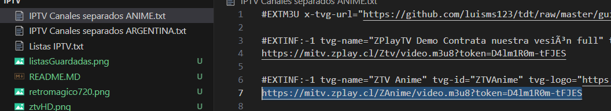
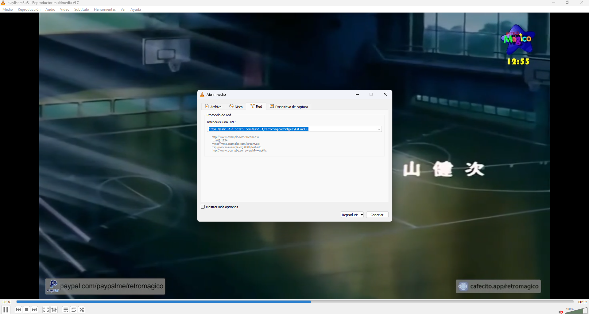
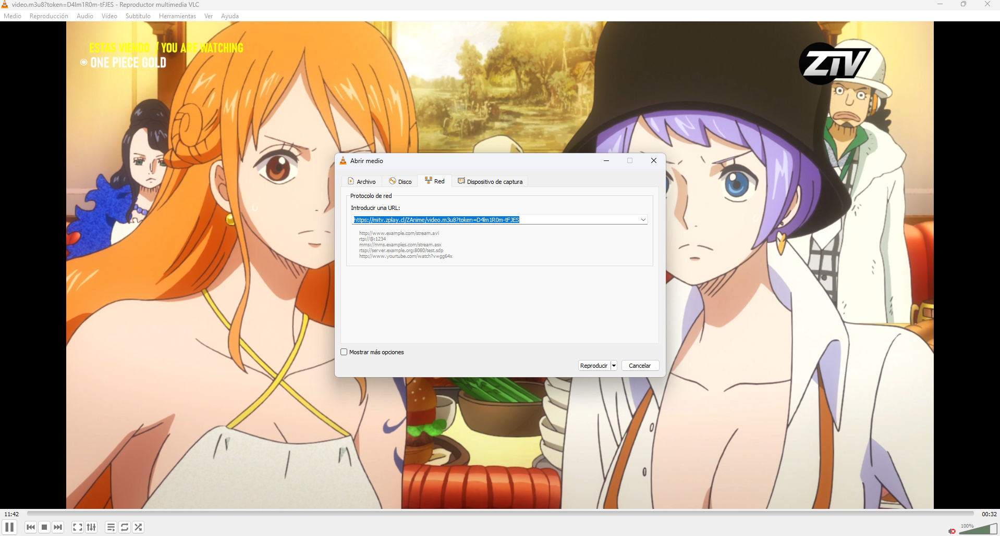
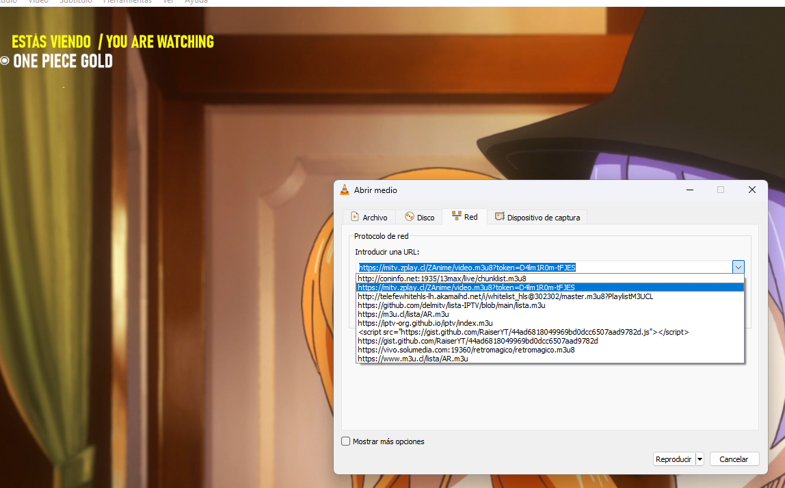

# LISTAS DE REPRODUCCION IPTV, ALGUNOS FUNCIONAN OTROS NO FUNCIONAN.

## los canales en resolución 720 funcionan en una notebook con intel atom y 1gb de ram, por ejemplo retromagico
## VLC funciona hasta en windows XP, asi que puede ser utilizado para mirar series animadas tranquilamente ya que es muchisimo más liviano que youtube, incluso más liviano que abrir cualquier navegador moderno

REPRODUCIR CON VLC
Hay dos formas de reproducir, una es poniendo la lista completa y que VLC cargue los canales que funcionen y no funcionen
Otra que para mi es la mejor, es poner el link. Por ejemplo el siguiente en medio/abrir ubicación de red para que solo abre un canal en especifico

## RETROMAGICO: funciona hasta en una laptop con intel atom y windows XP
https://ssh101-fl.bozztv.com/ssh101/retromagicochnl/playlist.m3u8

## ZTV: anime en full hd, NO FUNCIONA EN PC CON BAJOS REQUISITOS
https://mitv.zplay.cl/ZAnime/video.m3u8?token=D4lm1R0m-tFJES

## ANIMESTATION: Canal falopa de dibujos pero con un aire shankee
https://ssh101-fl.bozztv.com/ssh101/livestreamingtv/playlist.m3u8

## Luego de agregar un canal iptv, volvera aparecer para seleccionar sin tener que volver a escribirla.

ejemplo video youtube reproducir medio de red.
https://www.youtube.com/watch?v=koKlpg6sN28