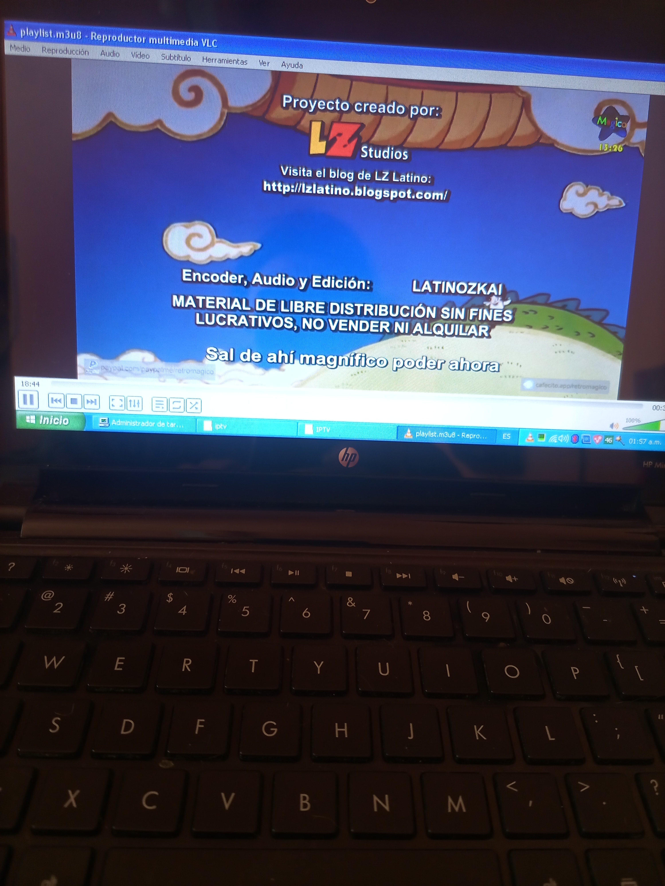

# LISTAS DE REPRODUCCION IPTV.

# ejemplo video youtube reproducir medio de red ->  https://www.youtube.com/watch?v=koKlpg6sN28

# los canales en resolución 720 funcionan en una notebook con intel atom, 1gb de ram y con windows XP, por ejemplo retromagico
## VLC funciona hasta en windows XP, asi que puede ser utilizado para mirar series animadas tranquilamente ya que es muchisimo más liviano que youtube, incluso más liviano que abrir cualquier navegador moderno. Es ideal para reciclar viejas laptop o computadoras

-------------->CANALES ANIME RECOMENDADO<-------------------

RETROMAGICO -> CALIDAD 720
https://ssh101-fl.bozztv.com/ssh101/retromagicochnl/playlist.m3u8

ZTV Anime -> CALIDAD 1080
https://mitv.zplay.cl/Ztv/video.m3u8?token=D4lm1R0m-tFJES

-------------->CANALES CINE RECOMENDADO<-------------------

+CINE -> CALIDAD 1080
https://tv.streaming-chile.com:19360/8142/8142.m3u8

# REPRODUCIR CON VLC:

## Hay tres formas de reproducir

## *Cargando ListaReproduccionoVLCPersonal.m3u8 como lista de reproducción

## *Poniendo la lista completa y que VLC cargue los canales que funcionen y no funcionen en en medio/abrir ubicación de red

## Poner el link de una sola página. Por ejemplo en medio/abrir ubicación de red para que solo abre un canal en especifico

## RETROMAGICO: funciona hasta en una laptop con intel atom y windows XP
https://ssh101-fl.bozztv.com/ssh101/retromagicochnl/playlist.m3u8

## ZTV: anime en full hd, NO FUNCIONA EN PC CON BAJOS REQUISITOS
https://mitv.zplay.cl/ZAnime/video.m3u8?token=D4lm1R0m-tFJES

## ANIMESTATION: Canal falopa de dibujos
https://ssh101-fl.bozztv.com/ssh101/livestreamingtv/playlist.m3u8

## Luego de agregar un canal iptv, volvera aparecer para seleccionar sin tener que volver a escribirla.

## NOTA: ALGUNOS CANALES FUNCIONAN OTROS NO FUNCIONAN

